<h1 align="center">Hamza Habib</h1>

<p align="center"><b>Physics and Machine Learning Driven Computational Drug Discovery</b></p>

<p align="center">
  Undergraduate at <b>Wesleyan University</b> &nbsp;·&nbsp; AI Drug Discovery Researcher at the <b>University of Toronto</b>
</p>

<p align="center">
  
</p>

<p align="center"><sub>A new molecule every day: a 3-layer message-passing GNN, trained from scratch on experimental lipophilicity data, reads the structure out as it rotates. <a href="#how-the-widget-works">How it works</a></sub></p>

## Featured projects

| Project | What it does |
|---|---|
| [**liposome-pipeline**](https://github.com/h-hamza0/liposome-pipeline) | Automated Martini 3 liposome construction with GROMACS, plus drug-partitioning analysis |
| [**BileSaltPipeline**](https://github.com/h-hamza0/BileSaltPipeline) | GROMACS workflows for bile-salt systems: backmapping, umbrella sampling and logP convergence analysis |

## Toolbox

<p>
  
  
  
  
  
  
  
  
  
</p>

## Contact

[hhabib@wesleyan.edu](mailto:hhabib@wesleyan.edu)

---

## How the widget works

[`.github/workflows/daily-molecule.yml`](.github/workflows/daily-molecule.yml) runs every day at 00:05 UTC and picks the next molecule from a [curated list](scripts/molecules.py) of drug-like compounds.

1. **3D structure:** RDKit embeds the molecule and relaxes it with MMFF94.
2. **GNN readout:** a small message-passing network ([`scripts/gnn.py`](scripts/gnn.py)) predicts lipophilicity (logD at pH 7.4). The glow you see travelling over atoms and bonds is the norm of each atom's hidden state after the embedding and each of the three message-passing rounds.
3. **Descriptors:** molecular weight, Crippen cLogP, TPSA, H-bond donors/acceptors and rotatable bonds come straight from RDKit.
4. **Rendering:** the output is a single self-contained animated SVG with no external services.

The network ([`scripts/train_gnn.py`](scripts/train_gnn.py)) was trained once on the 4,200-compound
[MoleculeNet Lipophilicity set](https://moleculenet.org/datasets-1) (Wu *et al.*, Chem. Sci. 2018, 9, 513; data from an AstraZeneca ChEMBL deposition).
On a random 10% held-out split it reaches **RMSE 0.60 log units (R² 0.73)**, compared with 1.16 for always predicting the mean ([`model/metrics.json`](model/metrics.json)).
Training uses PyTorch; the daily job only runs a NumPy forward pass of the saved weights. This is a demonstration model on a single random split, not a validated predictor.

```bash
pip install -r requirements-train.txt   # only needed to retrain
python scripts/train_gnn.py
python scripts/molecule_of_the_day.py --name Ibuprofen
```
